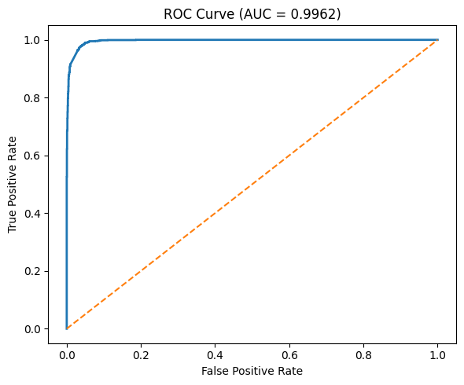
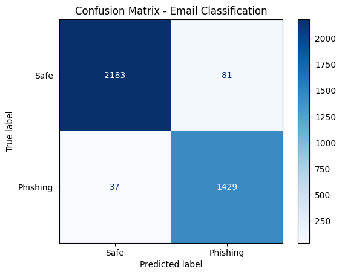

# 🛡️ Phishing Email Text Classifier

An end-to-end Machine Learning project that detects phishing emails using Natural Language Processing (NLP).

The project preprocesses email text, extracts TF-IDF features, trains multiple machine learning models, and predicts whether an email is phishing or legitimate.

---

## 🚀 Features

- Email text preprocessing
- URL removal
- HTML tag removal
- Email address removal
- Lowercase conversion
- TF-IDF Vectorization
- Machine Learning Classification
- Performance Evaluation
- Save & Load trained model

---


## 📂 Dataset Statistics

The dataset consists of labeled email messages categorized as **Safe (Legitimate)** and **Phishing** emails. It was used to train and evaluate the machine learning model for binary email classification.

### Dataset Overview

| Attribute | Value |
|-----------|------:|
| Total Samples | **18,650** |
| Safe Emails | **11,322** |
| Phishing Emails | **7,328** |
| Classification Type | Binary Classification |
| Data Type | Text |
| Features | Email Text |
| Target Variable | Safe (0), Phishing (1) |

### Class Distribution

| Class | Label | Samples | Percentage |
|------|:-----:|--------:|-----------:|
| Safe Email | 0 | 11,322 | 60.71% |
| Phishing Email | 1 | 7,328 | 39.29% |

### Train-Test Split

| Dataset | Samples | Percentage |
|---------|--------:|-----------:|
| Training Set | 14,920 | 80% |
| Testing Set | 3,730 | 20% |

### Data Preprocessing

The following preprocessing steps were applied before training:

- HTML tag removal
- URL removal
- Email address removal
- Lowercase conversion
- Whitespace normalization
- Text cleaning using Regular Expressions (Regex)
- TF-IDF Vectorization for feature extraction

### Dataset Characteristics

- **Problem Type:** Binary Text Classification
- **Domain:** Cybersecurity / Email Security
- **Language:** English
- **Feature Extraction:** TF-IDF Vectorizer
- **Target Classes:** Safe Email, Phishing Email

## 🛠 Technologies Used

- Python
- Pandas
- NumPy
- Scikit-learn
- Joblib
- Regex
- TF-IDF
- Google Colab

---

## Machine Learning Pipeline

```text
Email Text
     │
     ▼
Text Cleaning
     │
     ▼
TF-IDF Vectorization
     │
     ▼
Stacking Classifier
     │
     ▼
Prediction
```

## Models Used

- Logistic Regression
- Multinomial Naive Bayes
- Random Forest
- Linear SVM
- Stacking Classifier

---

# 📊 Model Performance

The Stacking Classifier achieved excellent performance on the test dataset.

| Metric | Score |
|---------|:-----:|
| Accuracy | **96.84%** |
| Precision (Weighted) | **96.88%** |
| Recall (Weighted) | **96.84%** |
| F1-Score (Weighted) | **96.84%** |
| Macro Precision | **96.48%** |
| Macro Recall | **96.95%** |
| Macro F1-Score | **96.70%** |
| ROC-AUC | **99.62%** |

## 📉 ROC Curve


---

## Class-wise Performance

| Class | Precision | Recall | F1-Score | Support |
|--------|:---------:|:------:|:--------:|--------:|
| Safe Email | 98.33% | 96.42% | 97.37% | 2264 |
| Phishing Email | 94.64% | 97.48% | 96.03% | 1466 |

---

## Confusion Matrix

| Actual \ Predicted | Safe | Phishing |
|--------------------|-----:|---------:|
| Safe | **2183** | 81 |
| Phishing | 37 | **1429** |

## 📈 Confusion Matrix



---


The model correctly classified **3612 out of 3730** test emails, resulting in an overall accuracy of **96.84%**.


## Repository Structure

```
Phishing-Email-Text-Classifier
│
├── README.md
├── requirements.txt
├── final_phishingdetection.ipynb
├── Phishing_Email.zip
├── ROC.png
├── confusion.png
└── LICENSE
```

---

## Installation

```bash
git clone https://github.com/Yehmeg/Phishing-Email-Text-Classifier.git
```

```bash
cd Phishing-Email-Text-Classifier
```

```bash
pip install -r requirements.txt
```

---

## Run

```bash
python app.py
```

or open

```
final_phishingdetection.ipynb
```

---

## Future Improvements

- Deep Learning (LSTM)
- BERT Classifier
- Explainable AI (SHAP)
- Streamlit Deployment
- Real-time Email Scanner

---

## Author

**Gomti Kumari**

B.Tech CSE (AI)

IGDTUW

Machine Learning | Data Science | AI

GitHub:
https://github.com/Yehmeg

LinkedIn:
https://www.linkedin.com/in/gomti-kumari-05bab4214/
